#git指南


[1. 起步](#1)

[1.1 关于版本控制（version control system）](#1.1)

[1.2 Git简史](#1.2)

[1.3 Git 是什么](#1.3)

[2. Git基础](#2)

[2.1 获取 Git 仓库](#2.1)

[2.2 记录每次更新到仓库](#2.2)

[2.3 查看提交历史](#2.3)

[2.4 撤消操作](#2.4)

[2.5 远程仓库的使用](#2.5)

[2.6 Git 别名](#2.6)

[3. Git分支](#3)

[3.1 分支简介](#3.1)

[3.2 分支的新建与合并](#3.2)

[3.3 远程合并](#3.3)


<div id="1"></div> 
##1. 起步
<div id="1.1"></div> 
###1.1 关于版本控制（version control system）
版本控制是一种记录一个或者若干文件内容变化，以便将来查阅特定版本修订情况的系统。对于程序开发而言，我们对保存着软件源代码的文件作版本控制，但实际上，我们可以对任何类型的文件进行版本控制。包括UI设计文件图文修订等。VCS可以将选定的文件回溯到之前的状态，甚至将整个项目都回退到过去某个时间点的状态，可以比较文件的变化细节，查出最后是谁修改了哪个地方，从而找出导致怪异问题出现的原因，又是谁在何时报告了某个功能缺陷等等。 使用版本控制系统通常还意味着，就算你乱来一气把整个项目中的文件改的改删的删，你也照样可以轻松恢复到原先的样子。 但额外增加的工作量却微乎其微。

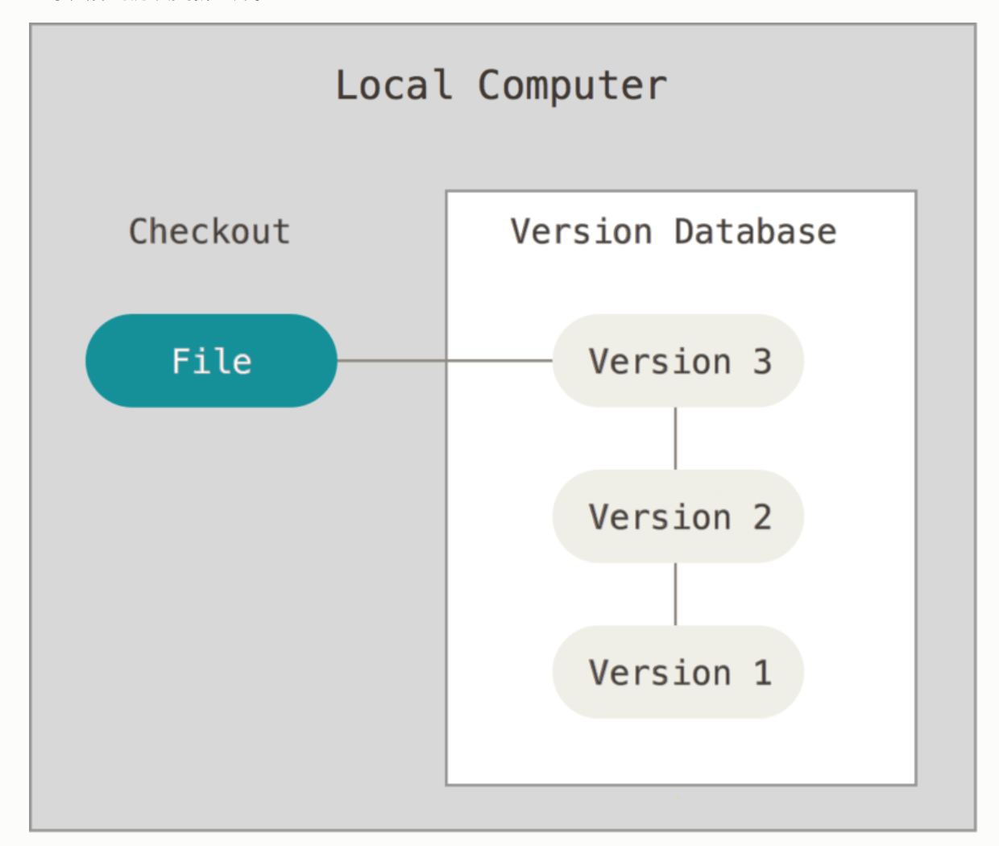

* 本地版本控制系统

采用某种简单的数据库来记录文件的历次更新差异

缺点：只要整个项目的历史记录被保存在单一位置，就有丢失所有历史更新记录的风险。

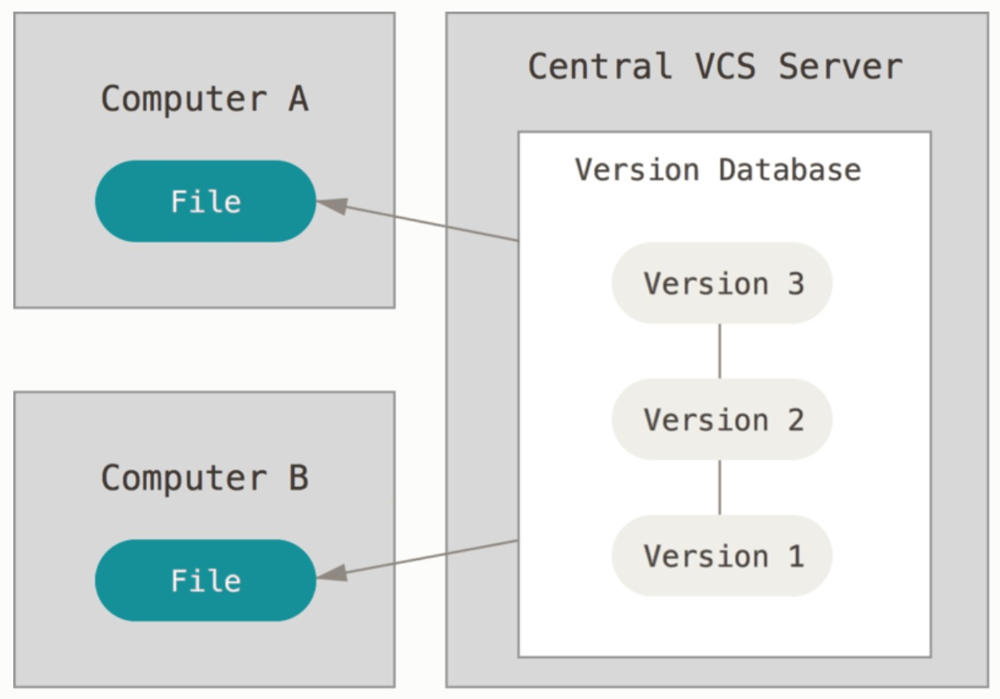

* 集中化的版本控制系统（Centralized Version Control Systems，简称 CVCS）

解决让在不同系统上的开发者协同工作。 
这类系统，诸如 CVS、Subversion 以及 Perforce 等，
都有一个单一的集中管理的服务器
保存所有文件的修订版本，而协同工作的人们都通过客户端连到这台服务器，
取出最新的文件或者提交更新。 多年以来，这已成为版本控制系统的标准做法。

缺点： 中央服务器的单点故障，无法提交更新，也就无法协同工作

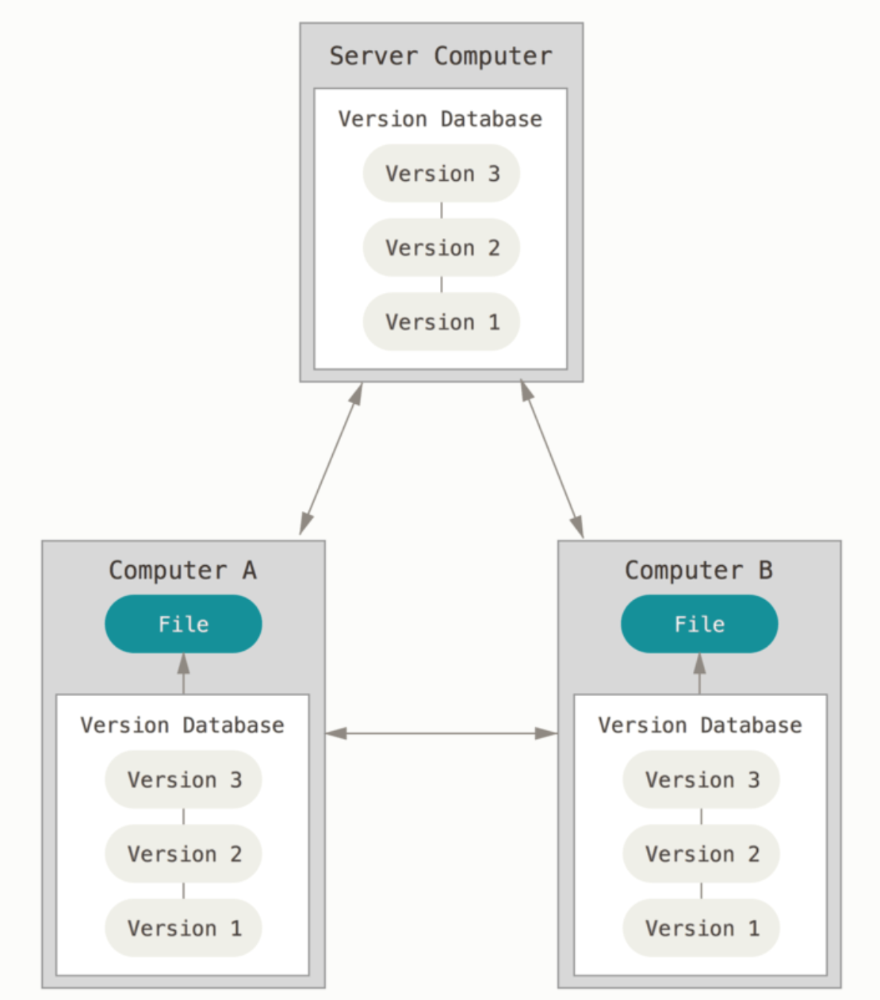

* 分布式版本控制系统（Distributed Version Control System，简称 DVCS）

客户端并不只是提取最新版本的文件快照， 而是把代码仓库完整地镜像下来，包括完整的历史记录。 这么一来，任何一处协同工作用的服务器发生故障，事后都可以用任何一个镜像出来的本地仓库恢复。 因为每一次的克隆操作，实际上都是一次对代码仓库的完整备份


<div id="1.2"></div> 
###1.2 Git简史
Git 简史
同生活中的许多伟大事物一样，Git 诞生于一个极富纷争大举创新的年代。

Linux 内核开源项目有着为数众多的参与者。 绝大多数的 Linux 内核维护工作都花在了提交补丁和保存归档的繁琐事务上（1991－2002年间）。 到 2002 年，整个项目组开始启用一个专有的分布式版本控制系统 BitKeeper 来管理和维护代码。

到了 2005 年，开发 BitKeeper 的商业公司同 Linux 内核开源社区的合作关系结束，他们收回了 Linux 内核社区免费使用 BitKeeper 的权力。 这就迫使 Linux 开源社区（特别是 Linux 的缔造者 Linus Torvalds）基于使用 BitKeeper 时的经验教训，开发出自己的版本系统。 他们对新的系统制订了若干目标：

* 速度

* 简单的设计

* 对非线性开发模式的强力支持（允许成千上万个并行开发的分支）

* 完全分布式

* 有能力高效管理类似 Linux 内核一样的超大规模项目（速度和数据量）

自诞生于 2005 年以来，Git 日臻成熟完善，在高度易用的同时，仍然保留着初期设定的目标。 它的速度飞快，极其适合管理大项目，有着令人难以置信的非线性分支管理系统

<div id="1.3"></div> 
###1.3 Git 是什么

Git 是把数据看作是对小型文件系统的一系列快照。 在 Git 中，每当你提交更新或保存项目状态时，它基本上就会对当时的全部文件创建一个快照并保存这个快照的索引。 为了效率，如果文件没有修改，Git 不再重新存储该文件，而是只保留一个链接指向之前存储的文件。 Git 对待数据更像是一个 快照流。

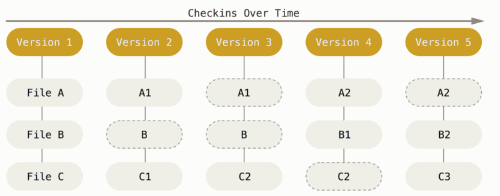

* 近乎所有操作都是本地执行

在 Git 中的绝大多数操作都只需要访问本地文件和资源，一般不需要来自网络上其它计算机的信息。 如果你习惯于所有操作都有网络延时开销的集中式版本控制系统，Git 在这方面会让你感到速度之神赐给了 Git 超凡的能量。 因为你在本地磁盘上就有项目的完整历史，所以大部分操作看起来瞬间完成。

举个例子，要浏览项目的历史，Git 不需外连到服务器去获取历史，然后再显示出来——它只需直接从本地数据库中读取。 你能立即看到项目历史。如果你想查看当前版本与一个月前的版本之间引入的修改， Git 会查找到一个月前的文件做一次本地的差异计算，而不是由远程服务器处理或从远程服务器拉回旧版本文件再来本地处理。

* Git 保证完整性

Git 中所有的数据在存储前都计算校验和，然后以校验和来引用。 这意味着不可能在 Git 不知情时更改任何文件内容或目录内容。 这个功能建构在 Git 底层，是构成 Git 哲学不可或缺的部分。 若你在传送过程中丢失信息或损坏文件，Git 就能发现。

Git 用以计算校验和的机制叫做 SHA-1 散列（hash，哈希）。 这是一个由 40 个十六进制字符（0-9 和 a-f）组成的字符串，基于 Git 中文件的内容或目录结构计算出来。 SHA-1 哈希看起来是这样：

```
24b9da6552252987aa493b52f8696cd6d3b00373
```

Git 中使用这种哈希值的情况很多，你将经常看到这种哈希值。 实际上，Git 数据库中保存的信息都是以文件内容的哈希值来索引，而不是文件名。

----

<div id="2"></div> 
##2. Git基础
<div id="2.1"></div> 
###2.1 获取 Git 仓库

通常有两种获取 Git 项目仓库的方式：

* 将尚未进行版本控制的本地目录转换为 Git 仓库；

* 从其它服务器 克隆 一个已存在的 Git 仓库。

两种方式都会在你的本地机器上得到一个工作就绪的 Git 仓库。


如果你想在克隆远程仓库的时候，自定义本地仓库的名字，你可以通过额外的参数指定新的目录名：

```
$ git clone https://github.com/libgit2/libgit2 mylibgit
```
目标目录名变为了 mylibgit。

<div id="2.2"></div> 
###2.2 记录每次更新到仓库

现在我们的机器上有了一个 真实项目 的 Git 仓库，并从这个仓库中检出了所有文件的 工作副本。 通常，你会对这些文件做些修改，每当完成了一个阶段的目标，想要将记录下它时，就将它提交到到仓库。

请记住，你工作目录下的每一个文件都不外乎这两种状态：已跟踪(tracked) 或 未跟踪(untracked)。 已跟踪的文件是指那些被纳入了版本控制的文件，在上一次快照中有它们的记录，在工作一段时间后， 它们的状态可能是未修改(unmodified)，已修改(modified)或已放入暂存区。简而言之，已跟踪的文件就是 Git 已经知道的文件。

工作目录中除已跟踪文件外的其它所有文件都属于未跟踪文件，它们既不存在于上次快照的记录中，也没有被放入暂存区(staged)。 初次克隆某个仓库的时候，工作目录中的所有文件都属于已跟踪文件，并处于未修改状态，因为 Git 刚刚检出了它们， 而你尚未编辑过它们。

编辑过某些文件之后，由于自上次提交后你对它们做了修改，Git 将它们标记为已修改文件。 在工作时，你可以选择性地将这些修改过的文件放入暂存区，然后提交所有已暂存的修改，如此反复。

* 忽略文件

一般我们总会有些文件无需纳入 Git 的管理，也不希望它们总出现在未跟踪文件列表。 通常都是些自动生成的文件，比如日志文件，或者编译过程中创建的临时文件等。 在这种情况下，我们可以创建一个名为 .gitignore 的文件，列出要忽略的文件的模式。 来看一个实际的 .gitignore 例子：

```
$ cat .gitignore
*.[oa]
*~
```

第一行告诉 Git 忽略所有以 .o 或 .a 结尾的文件。一般这类对象文件和存档文件都是编译过程中出现的。 第二行告诉 Git 忽略所有名字以波浪符（~）结尾的文件，许多文本编辑软件（比如 Emacs）都用这样的文件名保存副本。 此外，你可能还需要忽略 log，tmp 或者 pid 目录，以及自动生成的文档等等。 要养成一开始就为你的新仓库设置好 .gitignore 文件的习惯，以免将来误提交这类无用的文件

文件 .gitignore 的格式规范如下：

```
所有空行或者以 # 开头的行都会被 Git 忽略。

可以使用标准的 glob 模式匹配，它会递归地应用在整个工作区中。

匹配模式可以以（/）开头防止递归。

匹配模式可以以（/）结尾指定目录。

要忽略指定模式以外的文件或目录，可以在模式前加上叹号（!）取反。

```

```
# 忽略所有的 .a 文件
*.a

# 但跟踪所有的 lib.a，即便你在前面忽略了 .a 文件
!lib.a

# 只忽略当前目录下的 TODO 文件，而不忽略 subdir/TODO
/TODO

# 忽略任何目录下名为 build 的文件夹
build/

# 忽略 doc/notes.txt，但不忽略 doc/server/arch.txt
doc/*.txt

# 忽略 doc/ 目录及其所有子目录下的 .pdf 文件
doc/**/*.pdf
```
---


<div id="2.3"></div> 
###2.3 查看提交历史

在提交了若干更新，又或者克隆了某个项目之后，你也许想回顾下提交历史。 完成这个任务最简单而又有效的工具是 git log 命令。

不传入任何参数的默认情况下，git log 会按时间先后顺序列出所有的提交，最近的更新排在最上面。 正如你所看到的，这个命令会列出每个提交的 SHA-1 校验和、作者的名字和电子邮件地址、提交时间以及提交说明。


<div id="2.4"></div> 
###2.4 撤消操作

在任何一个阶段，你都有可能想要撤消某些操作。 这里，我们将会学习几个撤消你所做修改的基本工具。 注意，有些撤消操作是不可逆的。 这是在使用 Git 的过程中，会因为操作失误而导致之前的工作丢失的少有的几个地方之一。

有时候我们提交完了才发现漏掉了几个文件没有添加，或者提交信息写错了。 此时，可以运行带有 --amend 选项的提交命令来重新提交：

```
$ git commit --amend
```
这个命令会将暂存区中的文件提交。 如果自上次提交以来你还未做任何修改（例如，在上次提交后马上执行了此命令）， 那么快照会保持不变，而你所修改的只是提交信息。

文本编辑器启动后，可以看到之前的提交信息。 编辑后保存会覆盖原来的提交信息。

例如，你提交后发现忘记了暂存某些需要的修改，可以像下面这样操作：

```
$ git commit -m 'initial commit'
$ git add forgotten_file
$ git commit --amend
```
最终你只会有一个提交——第二次提交将代替第一次提交的结果。

取消暂存的文件

```
git reset HEAD <file>
```

---


<div id="2.5"></div> 
###2.5 远程仓库的使用

查看远程仓库
如果想查看你已经配置的远程仓库服务器，可以运行 ```git remote``` 命令。 它会列出你指定的每一个远程服务器的简写。 如果你已经克隆了自己的仓库，那么至少应该能看到 origin ——这是 Git 给你克隆的仓库服务器的默认名字：

添加远程仓库
我们在之前的章节中已经提到并展示了 ```git clone``` 命令是如何自行添加远程仓库的， 不过这里将告诉你如何自己来添加它。 运行 ```git remote add <shortname> <url>``` 添加一个新的远程 Git 仓库，同时指定一个方便使用的简写：

```
$ git remote
origin
$ git remote add pb https://github.com/paulboone/ticgit
$ git remote -v
origin	https://github.com/schacon/ticgit (fetch)
origin	https://github.com/schacon/ticgit (push)
pb	https://github.com/paulboone/ticgit (fetch)
pb	https://github.com/paulboone/ticgit (push)
```

现在你可以在命令行中使用字符串 pb 来代替整个 URL。 例如，如果你想拉取 Paul 的仓库中有但你没有的信息，可以运行 ```git fetch pb```


**从远程仓库中抓取与拉取**

从远程仓库中获得数据，可以执行：

```
$ git fetch <remote>
```

推送到远程仓库
当你想分享你的项目时，必须将其推送到上游。 这个命令很简单：```git push <remote> <branch>```。 当你想要将 master 分支推送到 origin 服务器时（再次说明，克隆时通常会自动帮你设置好那两个名字）， 那么运行这个命令就可以将你所做的备份到服务器：

```
$ git push origin master
```


<div id="2.6"></div> 
###2.6 Git 别名

Git 并不会在你输入部分命令时自动推断出你想要的命令。 如果不想每次都输入完整的 Git 命令，可以通过 ```git config``` 文件来轻松地为每一个命令设置一个别名。 这里有一些例子你可以试试：

```
$ git config --global alias.co checkout
$ git config --global alias.br branch
$ git config --global alias.ci commit
$ git config --global alias.st status
```

这意味着，当要输入 ```git commit``` 时，只需要输入 ```git ci```。 随着你继续不断地使用 Git，可能也会经常使用其他命令，所以创建别名时不要犹豫。


<div id="3"></div> 
##3. Git分支

<div id="3.1"></div> 
###3.1 分支简介

 Git 保存的不是文件的变化或者差异，而是一系列不同时刻的 **快照** 。
 
 在进行提交操作时，Git 会保存一个提交对象（commit object）。 知道了 Git 保存数据的方式，我们可以很自然的想到——该提交对象会包含一个指向暂存内容快照的指针。 但不仅仅是这样，该提交对象还包含了作者的姓名和邮箱、提交时输入的信息以及指向它的父对象的指针。 首次提交产生的提交对象没有父对象，普通提交操作产生的提交对象有一个父对象， 而由多个分支合并产生的提交对象有多个父对象，
 
 ```
 Git 的 master 分支并不是一个特殊分支。 它就跟其它分支完全没有区别。 
 之所以几乎每一个仓库都有 master 分支，是因为 git init 命令默认创建它，
 并且大多数人都懒得去改动它。
 ```
 
 <div id="3.2"></div> 
###3.2 分支的新建与合并

新建分支
首先，我们假设你正在你的项目上工作，并且在 master 分支上已经有了一些提交
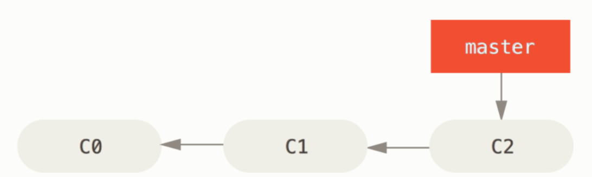

现在，你已经决定要解决你的公司使用的问题追踪系统中的 #53 问题。 想要新建一个分支并同时切换到那个分支上，你可以运行一个带有 -b 参数的 ```git checkout``` 命令：

 ```
 $ git checkout -b iss53
Switched to a new branch "iss53"
 ```
 
 它是下面两条命令的简写：
 
 ```
 $ git branch iss53
$ git checkout iss53
 ```
 
 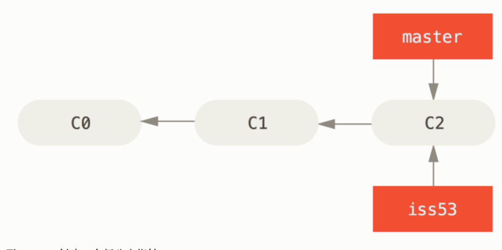

 
 你继续在 #53 问题上工作，并且做了一些提交。 在此过程中，iss53 分支在不断的向前推进，因为你已经检出到该分支 （也就是说，你的 HEAD 指针指向了 iss53 分支）
 
 ```
 $ vim index.html
$ git commit -a -m 'added a new footer [issue 53]'
 ```
 
 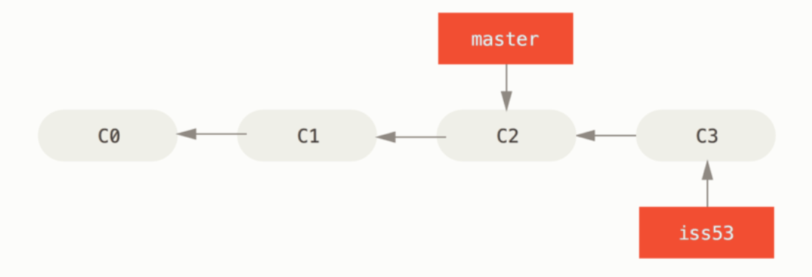

 现在你接到那个电话，有个紧急问题等待你来解决。 有了 Git 的帮助，你不必把这个紧急问题和 iss53 的修改混在一起， 你也不需要花大力气来还原关于 53# 问题的修改，然后再添加关于这个紧急问题的修改，最后将这个修改提交到线上分支。 你所要做的仅仅是切换回 master 分支。
 
 但是，在你这么做之前，要留意你的工作目录和暂存区里那些还没有被提交的修改， 它可能会和你即将检出的分支产生冲突从而阻止 Git 切换到该分支。 最好的方法是，在你切换分支之前，保持好一个干净的状态。 有一些方法可以绕过这个问题（即，暂存（stashing） 和 修补提交（commit amending））， 我们会在 贮藏与清理 中看到关于这两个命令的介绍。 现在，我们假设你已经把你的修改全部提交了，这时你可以切换回 master 分支了：
 
 ```
 $ git checkout master
Switched to branch 'master'
 ```
 
 这个时候，你的工作目录和你在开始 #53 问题之前一模一样，现在你可以专心修复紧急问题了。 请牢记：当你切换分支的时候，Git 会重置你的工作目录，使其看起来像回到了你在那个分支上最后一次提交的样子。 Git 会自动添加、删除、修改文件以确保此时你的工作目录和这个分支最后一次提交时的样子一模一样。
 
 接下来，你要修复这个紧急问题。 我们来建立一个 hotfix 分支，在该分支上工作直到问题解决：
 
 ```
 $ git checkout -b hotfix
Switched to a new branch 'hotfix'
$ vim index.html
$ git commit -a -m 'fixed the broken email address'
[hotfix 1fb7853] fixed the broken email address
 1 file changed, 2 insertions(+)
 ```
 
  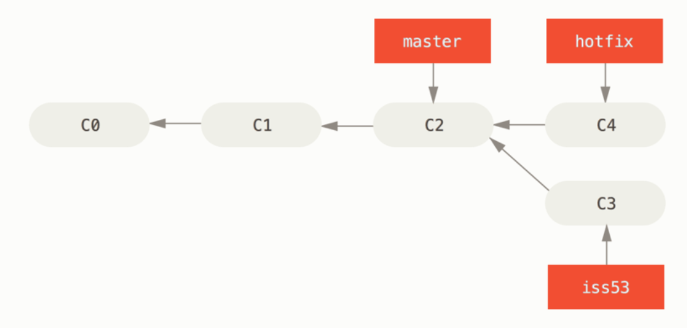
 
你可以运行你的测试，确保你的修改是正确的，然后将 hotfix 分支合并回你的 master 分支来部署到线上。 你可以使用 git merge 命令来达到上述目的：

```
$ git checkout master
$ git merge hotfix
Updating f42c576..3a0874c
Fast-forward
 index.html | 2 ++
 1 file changed, 2 insertions(+)
```

在合并的时候，你应该注意到了“快进（fast-forward）”这个词。 由于你想要合并的分支 hotfix 所指向的提交 C4 是你所在的提交 C2 的直接后继， 因此 Git 会直接将指针向前移动。换句话说，当你试图合并两个分支时， 如果顺着一个分支走下去能够到达另一个分支，那么 Git 在合并两者的时候， 只会简单的将指针向前推进（指针右移），因为这种情况下的合并操作没有需要解决的分歧——这就叫做 “快进（fast-forward）”。

现在，最新的修改已经在 master 分支所指向的提交快照中，你可以着手发布该修复了。

  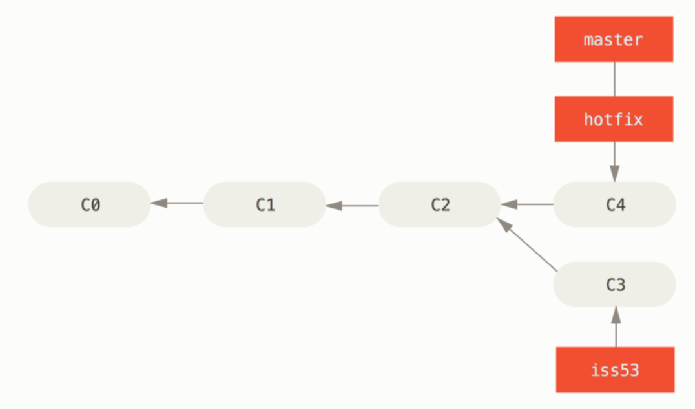
关于这个紧急问题的解决方案发布之后，你准备回到被打断之前时的工作中。 然而，你应该先删除 hotfix 分支，因为你已经不再需要它了 —— master 分支已经指向了同一个位置。 你可以使用带 -d 选项的 git branch 命令来删除分支：

```
$ git branch -d hotfix
Deleted branch hotfix (3a0874c).
```

现在你可以切换回你正在工作的分支继续你的工作，也就是针对 #53 问题的那个分支（iss53 分支）。

```
$ git checkout iss53
Switched to branch "iss53"
$ vim index.html
$ git commit -a -m 'finished the new footer [issue 53]'
[iss53 ad82d7a] finished the new footer [issue 53]
1 file changed, 1 insertion(+)
```
  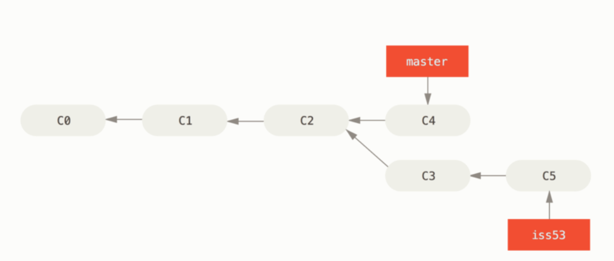

你在 hotfix 分支上所做的工作并没有包含到 iss53 分支中。 如果你需要拉取 hotfix 所做的修改，你可以使用 git merge master 命令将 master 分支合并入 iss53 分支，或者你也可以等到 iss53 分支完成其使命，再将其合并回 master 分支。


* 分支的合并
 
假设你已经修正了 #53 问题，并且打算将你的工作合并入 master 分支。 为此，你需要合并 iss53 分支到 master 分支，这和之前你合并 hotfix 分支所做的工作差不多。 你只需要检出到你想合并入的分支，然后运行 git merge 命令：

```
$ git checkout master
Switched to branch 'master'
$ git merge iss53
Merge made by the 'recursive' strategy.
index.html |    1 +
1 file changed, 1 insertion(+)
```

这和你之前合并 hotfix 分支的时候看起来有一点不一样。 在这种情况下，你的开发历史从一个更早的地方开始分叉开来（diverged）。 因为，master 分支所在提交并不是 iss53 分支所在提交的直接祖先，Git 不得不做一些额外的工作。 出现这种情况的时候，Git 会使用两个分支的末端所指的快照（C4 和 C5）以及这两个分支的公共祖先（C2），做一个简单的三方合并。


  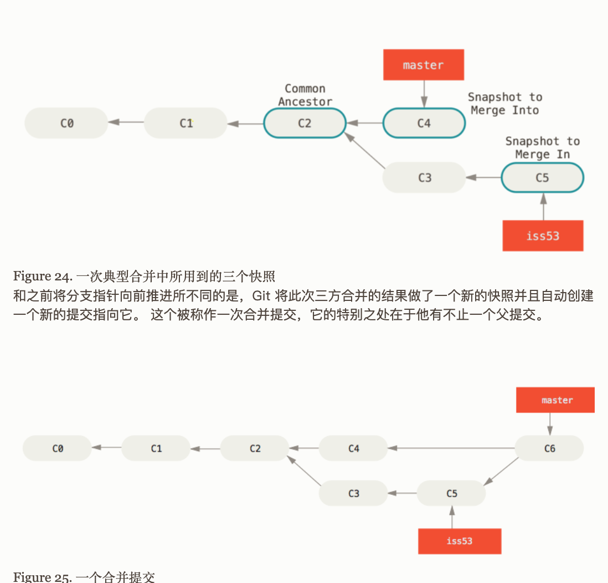
  
  既然你的修改已经合并进来了，就不再需要 iss53 分支了。 现在你可以在任务追踪系统中关闭此项任务，并删除这个分支。
  
  ```
  $ git branch -d iss53
  ```
  
  遇到冲突时的分支合并
  
有时候合并操作不会如此顺利。 如果你在两个不同的分支中，对同一个文件的同一个部分进行了不同的修改，Git 就没法干净的合并它们。 如果你对 #53 问题的修改和有关 hotfix 分支的修改都涉及到同一个文件的同一处，在合并它们的时候就会产生合并冲突：

```
$ git merge iss53
Auto-merging index.html
CONFLICT (content): Merge conflict in index.html
Automatic merge failed; fix conflicts and then commit the result.
```

此时 Git 做了合并，但是没有自动地创建一个新的合并提交。 Git 会暂停下来，等待你去解决合并产生的冲突。 你可以在合并冲突后的任意时刻使用 git status 命令来查看那些因包含合并冲突而处于未合并（unmerged）状态的文件：


```
$ git status
On branch master
You have unmerged paths.
  (fix conflicts and run "git commit")

Unmerged paths:
  (use "git add <file>..." to mark resolution)

    both modified:      index.html

no changes added to commit (use "git add" and/or "git commit -a")

```

任何因包含合并冲突而有待解决的文件，都会以未合并状态标识出来。 Git 会在有冲突的文件中加入标准的冲突解决标记，这样你可以打开这些包含冲突的文件然后手动解决冲突。 出现冲突的文件会包含一些特殊区段，看起来像下面这个样子：

```
<<<<<<< HEAD:index.html
<div id="footer">contact : email.support@github.com</div>
=======
<div id="footer">
 please contact us at support@github.com
</div>
>>>>>>> iss53:index.html
```

这表示 HEAD 所指示的版本（也就是你的 master 分支所在的位置，因为你在运行 merge 命令的时候已经检出到了这个分支）在这个区段的上半部分（======= 的上半部分），而 iss53 分支所指示的版本在 ======= 的下半部分。 为了解决冲突，你必须选择使用由 ======= 分割的两部分中的一个，或者你也可以自行合并这些内容。 例如，你可以通过把这段内容换成下面的样子来解决冲突：

```
<div id="footer">
please contact us at email.support@github.com
</div>
```

上述的冲突解决方案仅保留了其中一个分支的修改，并且 <<<<<<< , ======= , 和 >>>>>>> 这些行被完全删除了。 在你解决了所有文件里的冲突之后，对每个文件使用 git add 命令来将其标记为冲突已解决。 一旦暂存这些原本有冲突的文件，Git 就会将它们标记为冲突已解决。

如果你想使用图形化工具来解决冲突，你可以运行 git mergetool，该命令会为你启动一个合适的可视化合并工具，并带领你一步一步解决这些冲突：

```
$ git mergetool

This message is displayed because 'merge.tool' is not configured.
See 'git mergetool --tool-help' or 'git help config' for more details.
'git mergetool' will now attempt to use one of the following tools:
opendiff kdiff3 tkdiff xxdiff meld tortoisemerge gvimdiff diffuse diffmerge ecmerge p4merge araxis bc3 codecompare vimdiff emerge
Merging:
index.html

Normal merge conflict for 'index.html':
  {local}: modified file
  {remote}: modified file
Hit return to start merge resolution tool (opendiff):
```

如果你想使用除默认工具（在这里 Git 使用 opendiff 做为默认的合并工具，因为作者在 Mac 上运行该程序） 外的其他合并工具，你可以在 “下列工具中（one of the following tools）” 这句后面看到所有支持的合并工具。 然后输入你喜欢的工具名字就可以了。


<div id="3.3"></div> 
###3.3 远程合并

远程仓库名字 “origin” 与分支名字 “master” 一样，在 Git 中并没有任何特别的含义一样。 同时 “master” 是当你运行 git init 时默认的起始分支名字，原因仅仅是它的广泛使用， “origin” 是当你运行 git clone 时默认的远程仓库名字。 如果你运行 git clone -o booyah，那么你默认的远程分支名字将会是 booyah/master。